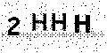

### Image Background Filter

Removing ``Dust and Scratches / Pepper Salt`` Noises from images.

#### Required Modules

````python
>> pip install pillow
````

##### How to Run Code

Run ``image_background_filter.py``, it will read ``image_noise.jpg`` which contains noise, and will create a new image as ``image_clear.jpg`` with noise removed.

#### Illustrations

> Input Image : ``image_noise.jpg``
>
> 

> Output Image : ``image_clear.jpg``
>
> 

